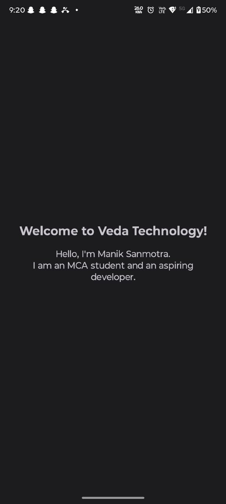

# Veda Welcome App

## Project Overview
A simple Android welcome application developed using Kotlin and XML for the Veda Technology Android Development Track. The app displays a welcome message and a short introduction.

## Technologies Used
- Kotlin
- XML Layouts
- Android Studio
- Gradle

## Approach
1. Created a new Android Studio project using Kotlin.
2. Designed a simple XML layout using TextView.
3. Added the welcome message and introduction.
4. Connected a Motorola Edge 50 Pro via USB debugging.
5. Built and ran the app successfully on the physical device.

## Features
- Displays "Welcome to Veda Technology!"
- Displays name and short introduction.
- Simple single-screen UI.

## Configuration
- Language: Kotlin
- UI: XML
- Device: Motorola Edge 50 Pro
- USB Debugging: Enabled
- Build Tool: Gradle

## How to Run
1. Clone the repository.
2. Open the project in Android Studio.
3. Sync Gradle.
4. Connect an Android device or start an emulator.
5. Click Run.

## Deployment / Execution
The app was built and installed on a Motorola Edge 50 Pro using Android Studio. It launched successfully and displayed the welcome message and introduction.

## Rollback Evidence
No rollback was required because the initial deployment was successful.  
If a future change causes issues, rollback can be performed using:

git revert <commit-hash>
git push origin main

Then rebuild and reinstall the app.

## Outcome
The application successfully displays the welcome message and introduction on a physical Android device.

## Screenshot
